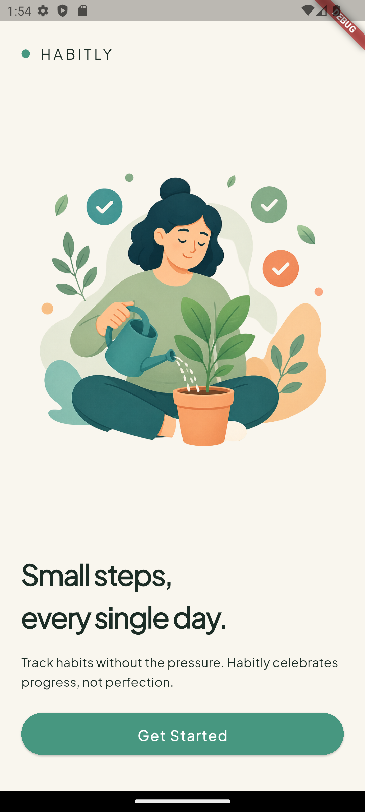
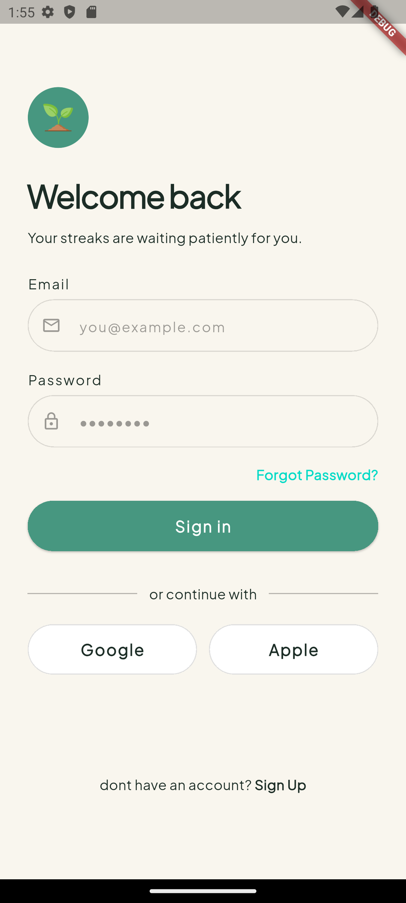
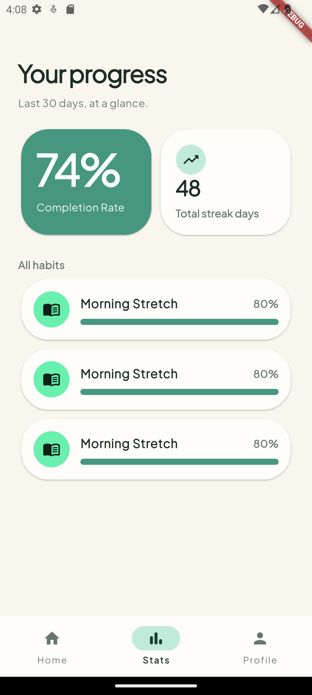

# Habitly 🌱

Habitly adalah aplikasi mobile habit & goal tracker yang dibangun menggunakan Flutter. Project ini dibuat sebagai media belajar sekaligus portofolio, dengan fokus pada penerapan praktik pengembangan Flutter modern — mulai dari design system, state management, autentikasi manual, testing, hingga CI/CD.

> 🚧 **Status:** Masih dalam tahap pengembangan aktif. Beberapa fitur di bawah masih dalam progres.

## ✨ Tentang Project

Habitly dibangun bukan sekadar untuk menghasilkan aplikasi yang jadi, tapi untuk memperdalam pemahaman terhadap konsep-konsep berikut secara langsung lewat praktik:

- Autentikasi berbasis token (JWT) secara manual — tanpa Firebase Auth
- State management dengan **Riverpod**
- Unit testing & widget testing
- CI dengan GitHub Actions
- Design system yang terstruktur (colors, typography, theming terpusat)

## 🛠️ Tech Stack

- **Flutter** — framework utama
- **Riverpod** — state management *(direncanakan)*
- **Dio** — HTTP client untuk komunikasi API *(direncanakan)*
- **flutter_secure_storage** — penyimpanan token yang aman *(direncanakan)*
- **google_fonts** — font Plus Jakarta Sans
- **GitHub Actions** — CI/CD *(direncanakan)*

## 🎨 Desain

Desain UI/UX Habitly dirancang di Figma:

🔗 [Lihat desain di Figma](https://www.figma.com/design/mj38RUe1LwtYpDsf5pDeqA/hibitly-app)

### Design System

Warna, tipografi, dan komponen tema disusun terpusat agar konsisten di seluruh aplikasi:

```
lib/style/
├── colors/
│   └── habitly_colors.dart      # Palet warna dari Figma
├── typography/
│   └── habitly_textstyles.dart  # Text styles (Plus Jakarta Sans)
└── theme/
    └── habitly_theme.dart       # ThemeData terpusat (light & dark)
```

## 📱 Screenshots

<!-- Ganti path di bawah dengan lokasi screenshot kamu, misal di folder docs/screenshots/ -->

| Onboarding | Login | Stats |
|---|---|---|
|  |  |  |

## 📂 Struktur Project

```
lib/
├── screen/
│   ├── main/            # Onboarding, MainScreen (bottom navigation)
│   ├── home/             # Home screen
│   ├── stats/             # Stats screen
│   ├── profile/            # Profile screen
│   └── new_habit/          # Form tambah habit
├── style/                   # Design system (colors, typography, theme)
├── static/                   # Konstanta, route
└── main.dart
```

## 🚀 Roadmap

- [x] Setup design system (colors, typography, theme)
- [x] Halaman Onboarding
- [x] Halaman Login & Register (UI)
- [x] Bottom navigation (Home, Stats, Profile)
- [x] Halaman Stats (UI)
- [x] Komponen New Habit — icon selector (UI)
- [ ] Autentikasi manual dengan JWT (access + refresh token)
- [ ] Integrasi Riverpod untuk state management
- [ ] Integrasi REST API untuk data habit
- [ ] Unit test & widget test
- [ ] Setup CI dengan GitHub Actions
- [ ] Setup CD (build & distribute otomatis)

## 🏃 Cara Menjalankan Project

```bash
git clone https://github.com/pakdhel/habitly-app-flutter.git
cd habitly-app-flutter
flutter pub get
flutter run
```

## 👤 Author

**Fadhel Hayat**
- Portfolio: [fadhelhayat.vercel.app](https://fadhelhayat.vercel.app/)
- GitHub: [@pakdhel](https://github.com/pakdhel)
