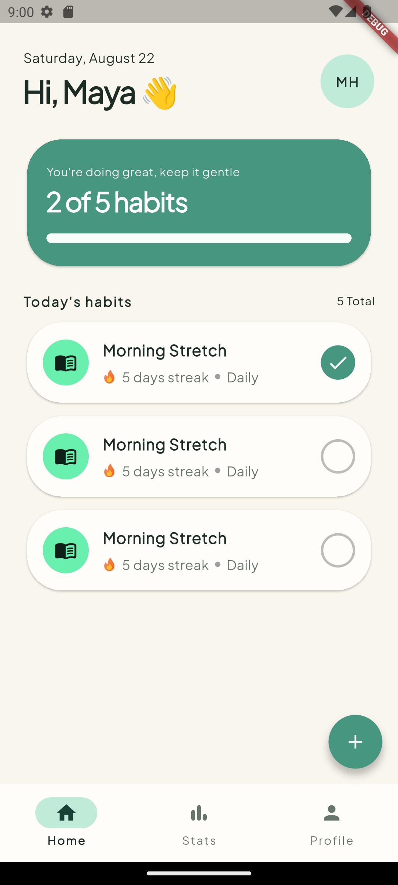
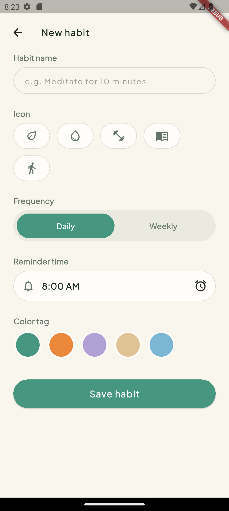
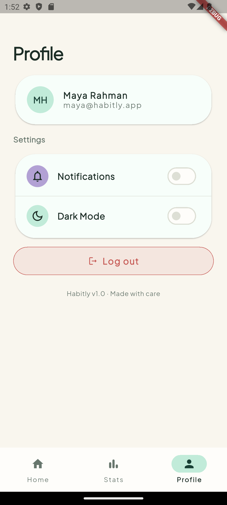

# Habitly 🌱

Habitly adalah aplikasi mobile habit & goal tracker yang dibangun menggunakan Flutter. Project ini dibuat sebagai media belajar sekaligus portofolio, dengan fokus pada penerapan praktik pengembangan Flutter modern — mulai dari design system, state management, autentikasi manual, testing, hingga CI/CD.

> ✅ **Status:** Autentikasi manual (JWT), state management (Riverpod), dan integrasi data habit (icon, warna, frequency, status selesai) sudah berfungsi penuh. Selanjutnya: unit test, widget test, dan CI/CD.

## ✨ Tentang Project

Habitly dibangun bukan sekadar untuk menghasilkan aplikasi yang jadi, tapi untuk memperdalam pemahaman terhadap konsep-konsep berikut secara langsung lewat praktik:

- Autentikasi berbasis token (JWT) secara manual — tanpa Firebase Auth
- State management dengan **Riverpod**
- Unit testing & widget testing
- CI dengan GitHub Actions
- Design system yang terstruktur (colors, typography, theming terpusat)

## 🛠️ Tech Stack

- **Flutter** — framework utama
- **Riverpod** — state management (Provider, Notifier, AsyncNotifier)
- **Dio** — HTTP client untuk komunikasi API, dilengkapi interceptor custom
- **flutter_secure_storage** — penyimpanan token yang aman
- **google_fonts** — font Plus Jakarta Sans
- **DummyJSON** — API sementara untuk latihan auth (`/auth`) dan data habit (`/todos`)
- **GitHub Actions** — CI/CD *(direncanakan)*

## 🎨 Desain

Desain UI/UX Habitly dirancang di Figma:

🔗 [Lihat desain di Figma](https://www.figma.com/design/mj38RUe1LwtYpDsf5pDeqA/hibitly-app)

### Design System

Warna, tipografi, dan komponen tema disusun terpusat agar konsisten di seluruh aplikasi:

```
lib/style/
├── colors/
│   └── habitly_colors.dart      # Palet warna dari Figma
├── typography/
│   └── habitly_textstyles.dart  # Text styles (Plus Jakarta Sans)
└── theme/
    └── habitly_theme.dart       # ThemeData terpusat (light & dark)
```

## 📱 Screenshots

<!-- Ganti path di bawah dengan lokasi screenshot kamu, misal di folder docs/screenshots/ -->

| Onboarding | Login | Home |
|---|---|---|
|  |  |  |

| Stats | New Habit | Profile |
|---|---|---|
|  |  |  |

## 📂 Struktur Project

```
lib/
├── data/
│   ├── api/       # AuthServices, HabitServices, DioClient, AuthInterceptor
│   ├── models/      # User, Habit, HabitListResponse
│   ├── providers/   # Provider Riverpod (providers, user_provider, habits_provider)
│   └── storage/            # TokenStorage (flutter_secure_storage)
├── screen/
│   ├── home/
│   ├── login/
│   ├── main/            # MainScreen (bottom navigation)
│   ├── new_habit/
│   ├── onboarding/
│   ├── profile/
│   ├── register/
│   └── stats/
├── static/                   # NavigationRoute, HabitIcons, ColorHexConverter, ColorUtils
├── style/                     # Design system (colors, typography, theme)
├── main.dart
└── splash_screen.dart          # Session check & auto-login
```

## 🚀 Roadmap

**UI / Design System**
- [x] Setup design system (colors, typography, theme — sinkron dari Figma)
- [x] Halaman Onboarding, Login & Register, Home, Stats, Profile, New Habit
- [x] Bottom navigation dengan IndexedStack

**Autentikasi & Arsitektur**
- [x] Autentikasi manual dengan JWT (access + refresh token) via DummyJSON
- [x] Dio interceptor: auto-attach access token, auto-refresh saat 401
- [x] Session check (auto-login) di SplashScreen
- [x] Integrasi Riverpod (Provider, Notifier, AsyncNotifier) untuk auth & data habit
- [x] Integrasi REST API untuk data habit (list, tambah, toggle status)
- [x] Tampilkan icon, warna, dan frequency habit (disimpan lokal via Riverpod,
      karena tidak didukung skema `/todos` DummyJSON)
- [ ] Unit test & widget test
- [ ] Setup CI dengan GitHub Actions
- [ ] Setup CD (build & distribute otomatis)
- [ ] Migrasi dari DummyJSON ke Supabase untuk persistensi data sungguhan

## ⚠️ Known Limitations (DummyJSON)

DummyJSON dipakai sebagai API sementara untuk belajar integrasi auth dan REST API,
bukan backend produksi. Beberapa keterbatasan yang sudah teridentifikasi:

- **Write tidak persisten** — perubahan lewat `POST`/`PUT`/`DELETE` dibalas sukses
  oleh server, tapi tidak benar-benar tersimpan. Ditangani dengan strategi
  *optimistic update* (state lokal di Riverpod jadi source of truth selama sesi
  aplikasi berjalan).
- **ID hasil `POST /todos/add` tidak unik** — DummyJSON selalu mengembalikan ID
  yang sama untuk setiap todo baru, alih-alih ID unik/auto-increment. Ini
  memengaruhi item yang ditambahkan dalam satu sesi (misalnya toggle status bisa
  memengaruhi lebih dari satu item baru sekaligus). Diterima sebagai batasan
  API pihak ketiga, akan otomatis teratasi setelah migrasi ke Supabase (ID
  berbasis `uuid`).
- **Refresh token tidak benar-benar expired** — tidak ada mekanisme resmi untuk
  mensimulasikan refresh token kedaluwarsa, sehingga jalur *rollback*/logout
  paksa pada `AuthInterceptor` diuji secara manual (token dirusak sengaja),
  bukan lewat skenario natural.

## 🏃 Cara Menjalankan Project

```bash
git clone https://github.com/pakdhel/habitly-app-flutter.git
cd habitly-app-flutter
flutter pub get
flutter run
```

## 👤 Author

**Fadhel Hayat**
- Portfolio: [fadhelhayat.vercel.app](https://fadhelhayat.vercel.app/)
- GitHub: [@pakdhel](https://github.com/pakdhel)